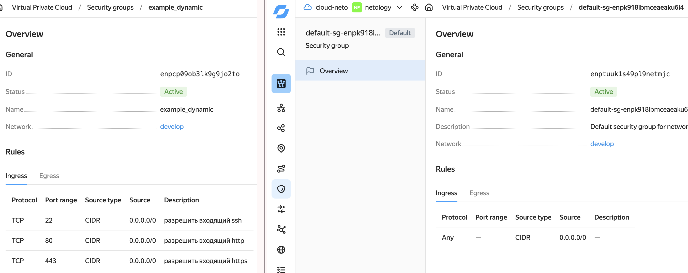
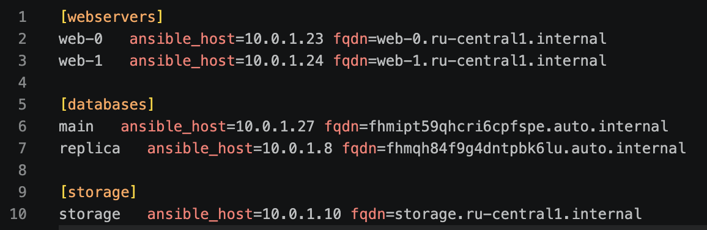

# Домашнее задание к занятию «Управляющие конструкции в коде Terraform»

### Задание 1
Cкриншот входящих правил «Группы безопасности» в ЛК Yandex Cloud  

------

### Задание 2

1) см. файл [count-vm.tf](./src/count-vm.tf) и [for_each-vm.tf](./src/for_each-vm.tf)

------

### Задание 3
см. файл [disk_vm.tf](./src/disk_vm.tf)

------

### Задание 4

------