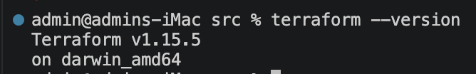
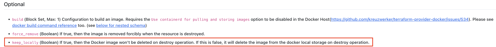

### Задание 1


1. Чтобы скачать зависимости - выполнил terraform init
2. Согласно .gitignore личную информацию допустимо хранить в terraform-файле personal.auto.tfvars
3. ```"result": "uEX3U3hZXfeTT9zX"```
4.  ##### Ошибка 1: 
    Строка 23 resource "docker_image" {
     Error: Missing name for resource
│ 
│   on main.tf line 23, in resource "docker_image":
│   23: resource "docker_image" {
│ 
│ All resource blocks must have 2 labels (type, name).
Значение ресурса в блоке должно иметь два лейбла (тип и имя). В данном случае указан только тип "docker_image". Чтобы исправить ошибку , нужно задать уникальное имя ресурсу. Например: 
resource "docker_image" "nginx" {

   ##### Ошибка 2:
    Строка 28: resource "docker_container" "1nginx" {
    Error: Invalid resource name
│ 
│   on main.tf line 28, in resource "docker_container" "nginx":
│   28: resource "docker_container" "1nginx" {
│ 
│ A name must start with a letter or underscore and may contain only letters, digits, underscores, and dashes.
    Ошибка в имени ресурса. В имени содержится цифра "1". Исправил имя на "nginx"

    Далее были ошибки: 
    Строка 28: resource "docker_container" "1nginx" 
    строка  30:   name  = "example_${random_password.random_string_FAKE.resulT}"
    Исправил соответственно:
    Строка 28: resource "docker_container" "nginx" 
    строка  30:   name  = "example_${random_password.random_string.result}"

    После чего ошибки ушли: 
    terraform validate
Success! The configuration is valid.
5. resource "random_password" "random_string" {
  length      = 16
  special     = false
  min_upper   = 1
  min_lower   = 1
  min_numeric = 1
}


resource "docker_image" "nginx" {
  name         = "nginx:latest"
  keep_locally = true
}

resource "docker_container" "nginx" {
  image = docker_image.nginx.image_id
  name  = "example_${random_password.random_string.result}"

  ports {
    internal = 80
    external = 9090
  }
}

```docker ps```
CONTAINER ID   IMAGE          COMMAND                  CREATED         STATUS         PORTS                  NAMES
81e21d799397   5aca99593157   "/docker-entrypoint.…"   4 minutes ago   Up 4 minutes   0.0.0.0:9090->80/tcp   example_uEX3U3hZXfeTT9zX
6. docker ps
CONTAINER ID   IMAGE          COMMAND                  CREATED         STATUS         PORTS                  NAMES
64c0e32480bd   5aca99593157   "/docker-entrypoint.…"   4 seconds ago   Up 3 seconds   0.0.0.0:9090->80/tcp   hello_world

опасность применения ключа  ```-auto-approve``` - в том, что при выполнении команды ```terraform apply -auto-approve``` мы минуем подтверждение (ввод "yes") изменения инфраструктуры. Это может привести к нежелательным последствиям. То есть при выполнении ```terraform apply -auto-approve``` - надо быть уверенным на 100% в своем коде, но человеческий фактор никто не отменял.
Данный ключ может пригодиться в процессах автоматизации (в скриптах, в пайплайнах) где не нужно ожидать ручного ввода подтверждения.
8. Содержимое файла **terraform.tfstate**
```json
{
  "version": 4,
  "terraform_version": "1.15.5",
  "serial": 17,
  "lineage": "e34d8ad1-8d92-66bc-e109-439d72e8f0a2",
  "outputs": {},
  "resources": [],
  "check_results": null
}

9. Объясните, почему при этом не был удалён docker-образ **nginx:latest**
Ответ кроется в этом блоке (строка 89). Мы указали keep_locally = true - значит , что наш докер образ хранится локально и при destroy образ НЕ будет удален. Если бы мы указали false, тогда при destroy локальный образ был бы удален.

```json
resource "docker_image" "nginx" {
  name         = "nginx:latest"
  keep_locally = true
}
