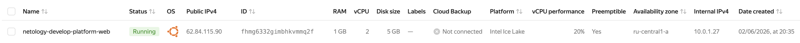
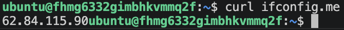
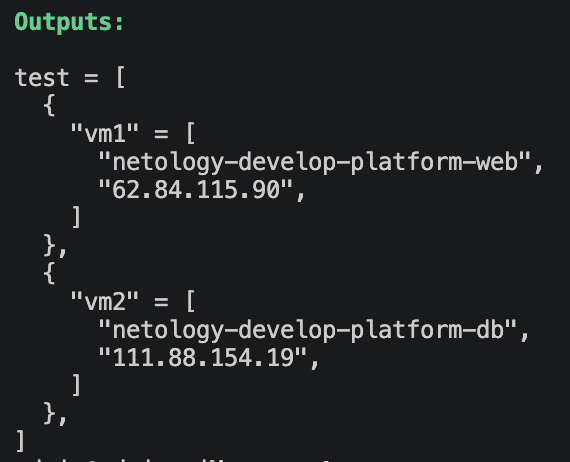

# Домашняя работа к занятию «Основы Terraform. Yandex Cloud»

### Задание 1
1. Проект изучил. 
2. Сервисный аккаунт и ключ создал (~/.authorized_key.json)
4. пару ssh ключей сгенерировал.
5. Инициализировал проект, ```terraform plan``` указал следующие ошибки: 
    1) не задана переменная "cloud_id".
    2) не задана переменная "folder_id".  
    Указал переменные, ошибка ушла. Суть ошибок - Terraform не выполнит код , пока не будут заданы необходимые переменные.  
    Долго искал причину ошибки выполнения ```terraform apply``` , в итоге нашел:  
        1) platform_id = "standart-v4" (синтаксическую ошибку нашел быстро "standarD"), но на этом ошибки не ушли). В итоге: 
       platform_id = "standart-v4" исправил на "standard-v3" (выбор семейства CPU)
        2)  cores         = 1 исправил на  cores         = 2 (количество ядер зависит от выбора platform_id)
        3) core_fraction = 5 исправил на core_fraction = 20 (количество гарантированных ядер также зависит от выбора platform_id).  
    После исправления - terraform выполнил код без ошибок.
6. Успешно по ssh ключу подключился к ВМ. 
8. Параметры ```preemptible = true``` и ```core_fraction=5``` очень могут быть полезными в учебных целях, либо на тестовом контуре. Первый параметр - прерываемая ВМ (ВМ будет выключаться через 12-24 часа после включения) , второе значение - гарантированный процент мощностей CPU, которая получит ВМ. В совокупности данные параметры помогают существенно сэкономить ресурсы (финансовые) , что актуально как в учебных целях, так и в коммерческих организациях.



### Задание 2

см. файл [variables.tf](./variables.tf)

### Задание 3

см. файл [vms_platform.tf](./vms_platform.tf)

### Задание 4

см. файл [outputs.tf](./outputs.tf)  


### Задание 5

Описал в файле [locals.tf](./locals.tf) local-блок. Использовал интерполяцию. Заменил имя двух ВМ.  
Было:  
netology-develop-platform-web  
netology-develop-platform-db  
Стало:  
neto-develop-platform-web  
neto-develop-platform-db  

### Задание 6

см. файл [vms_platform.tf](./vms_platform.tf) (блоки variable "vms_resources" и variable "vms_metadata")